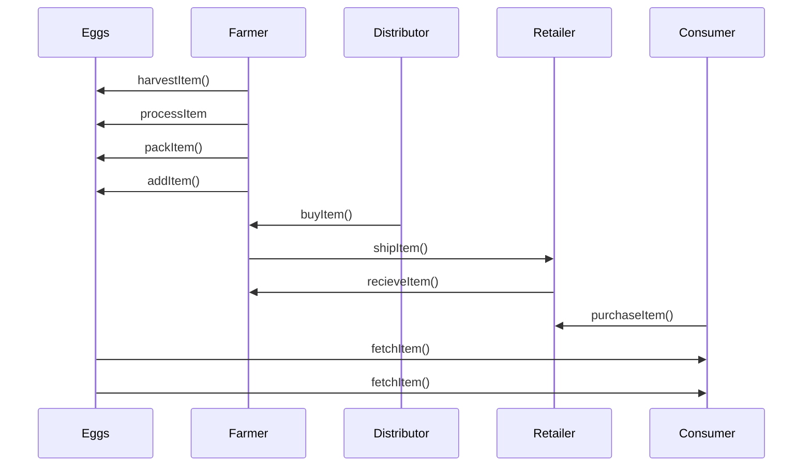
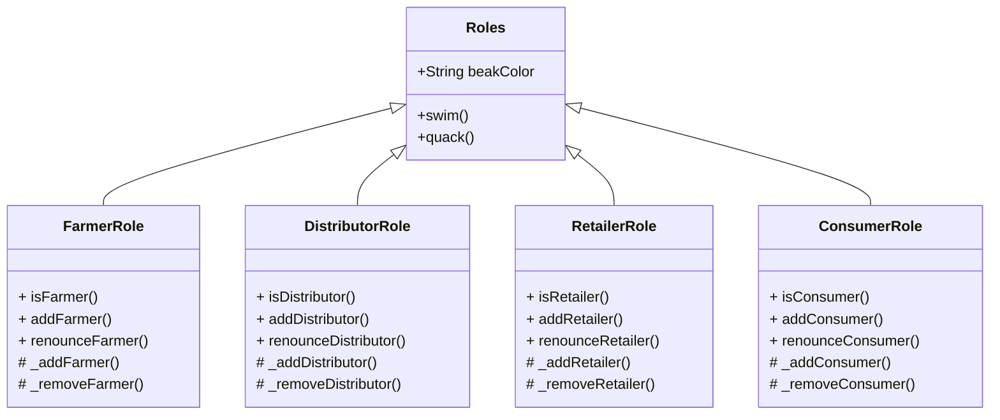
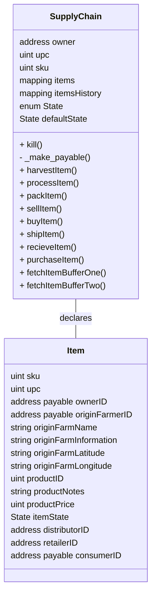
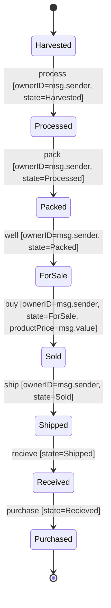

# Egg Supply chain tracking

This project implements supply chain tracking for eggs.
Everything is implemented completely decentralized via Ethereum Smart Contracts and IPFS.

The goal is to allow customers more trust in their purchase. 
In recent years, consumers have become more and more aware of the horrendous conditions in some chicken farms. At the same time, there have been repeated scandals or eggs being wrongfully labeled as organic.


UML diagrams are coded using mermaid.

I used the following library version:

**Truffle**: 5.5.0
**Ganache**: 7.0.1
**Solidity**: 0.8.12
**Node**: 16.13.2
**Web3.js**: 1.5.3


## 1 . Project Plan

### UML

### Activity diagram
Here's what the activity diagram looks like

[click here for full view](https://mermaid.live/view/#pako:eNqNksFOAyEQhl-FcNKkvgCHXmxNvOqVyxTGhVRYOgxNmqbvLrsrZmu7xhv8_zc_zGTO0vQWpZJCiIyHgtHgxkNHEHSsmkhA7I1PEFlsuy7fqi9AAelW3_jM5HeF-zvmGzL4z3tlz33M5SdwChdP6_X4uhIO6IiZXxnDw-MCk6g3mPPALBFg9n9GgLVzf9bLCE28ErtyWohpDSqRnU9zqDlXQYTG4xHnXBvEr7hUyDjIV-jw5xFrNUp8IBv3f0auZJUCeFt34TxUaMkOA2qp6tEC7bXU8VK5kiwwbq2vw5CKqeBKQp3M-ymadp-Y70WaxMsXI1PMKg)


### Class diagrams
[click here for full view]([TODO](https://mermaid.live/view/#pako:eNp1lduO2jAQhl_FSm9asbwA6lWhVZFW22rpJRIyzkCsOHbqAwht9907ju1snAM3ib9_7PxzCHkrmCqh2BRMUGN2nF41bY6yW5FXJcC8HSXB3-pgNZdXcgZab5VQOmJz583nL3Hx11FW-9V7OmKrpHENaH9UOolwk3C_k9CynEINUjnJYKx8IqeZeKQaGnXLwnsnO24wg7OzamxmoGR-ZnmyNCMGV_NCMDbSem8_qJ7WKMDM0RglMzkPPiYsWPjA_dNfwVIuJs9POHMwhcnDWAkuZmjwMRTQyVF2w0a-_luvB-XI8KiDmTbMIROGA-gfE1LeW2hIzNVxaf3V1C4HrmUBYB4acFdLH_QsgKi7BL3fLYiaX7kMKaQYE96dgfZCG1jS9vKidEMtV3Ip5BlV68rFI56VvA4CUkatVqVjdmwr4hdlwcxu-K05i0cdLLWAV44V7O7zKpQfPRoXSMcWLRWOxU55vZ_Ng2tb8dhWlMvQr7Sr64EHndXYqu4-9rGhbeuz80bNBPxEn0o_PAfpGtKnEvIr4UKdsD1dkZoLEYZ4TU4NreEUfQe4IhXVNzDWT1ZCWD2GXjOEf5DDtQEhhuuze2RyxdvhWgPjcIPsRKdZRU3GLmBZ5cE3d7mA_iVhQflzV_EFHBYaXxsfssEyYBe0H4riqcDWNJSX-K3oGnEsbAU4xMUGb0uq62OBB2Gca0us2veSY4GLjdUOngqKA3F4SJbWISZ-bgJ8_w-JHTZb))
Solidity roles contracts

Solidity SupplyChain contract


### Sequence diagram

[click here for full view]([TODO](https://mermaid.live/view/#pako:eNrtWEtv2zAM_iuCgN7SP-BDD2tarBi2DE23Uy6czDRCHdnTI4VR9L-PfiWyrMbJ0AELUh-C2HyIH_mZpvTCRZ4iT7jB3w6VwKmERw3rhWJ0FaCtFLIAZdkt6DXq4fOpNFbLX87GhPdoQWYxyXWujIs6vNW5sjcqHUrmriiy8noFUpG51SBs1HEtmYKFRtr8NvGzy6ur7QoJ-wx6g9pYdmexxUymcgMWe4A7i9o8EkZCSB8pEbSAwueotx6qiIsgMkprkUHJSKZM5SVX7G4aOI0mpNG5uGDfdS7QmD3wWw0v3nGgQ5u3wPiVSNhP1HJZBgCGxYLMMuNEtcTSZc2z6vI1L8l7NLbZl53BYVH9KFKKgzCljuRzSzcjLsbLtAKzapxgZpAtqzcgPRLJt9nDOJp4KNV6TnswUtyTb6wouaMMiCefDVHSBDrjjOkbHEMXlj8rej9XsmBASxRtncyuTh9U-k-pNMcsG6NSqDNKpcDgjKjUBi3FWZPqkyu98nujR0Csvt7W_WBWGWdc39PfEW7SZ1tdyrogSwoc1rlT9gQYOGFpl75c301rFDXEbix5F0runY7qHpKwhy53X3OFZZRI_vB2eq2zalKH0DxQPKB_9g0-PsVn0TXvUUjcoFf4bl8W8GmouF2jv5M7ZD8UujqKbKdGrwmbNa2wfjm6ZL17Z_SKPviWnd5mw2lB8HyOdKcC4ZZjqOmv4h0kHLAbGfo6I2Z22fqXzOy3ilOh5e6kqK_rkcufL3rHOZ7gjSMZPuHkZg0y5Ql_qawW3K5wjQue0N8U9NOCL9Qr6bm6hjeppDGLJ0ug_E040NA1L5XgidUOO6X2sK7Vev0DtFeppA))

```mermaid
sequenceDiagram
    participant Farmer
    participant Distributer
    participant Retailer
    participant Consumer
    participant FrontEnd
    participant SupplyChainContract
    participant ContractData
    
    Farmer ->> FrontEnd: Harverst Item
    activate Farmer
    FrontEnd ->> SupplyChainContract: Register new Item
    activate FrontEnd
    SupplyChainContract ->> FrontEnd: Display transaction ID
    activate SupplyChainContract

    %% Process
    Farmer ->> FrontEnd: Process Item
    FrontEnd ->> SupplyChainContract: Process Item
    SupplyChainContract ->> ContractData: Verify
    activate ContractData
    alt successful
        ContractData-->>SupplyChainContract: OK
        SupplyChainContract ->> ContractData: UpdateProduct State
        SupplyChainContract -->> FrontEnd: Display transaction hash
    else failed
        ContractData-->>SupplyChainContract: NOT OK
        SupplyChainContract -->> FrontEnd: Display failure
        deactivate ContractData
    end

    %% Pack Item
    Farmer ->> FrontEnd: Pack Item
    FrontEnd ->> SupplyChainContract: Pack Item
    SupplyChainContract ->> ContractData: Verify ownership and product state
    activate ContractData
    alt successful
        ContractData-->>SupplyChainContract: OK
        SupplyChainContract ->> ContractData: UpdateProduct State
        SupplyChainContract -->> FrontEnd: Display transaction hash
    else failed
        ContractData-->>SupplyChainContract: NOT OK
        SupplyChainContract -->> FrontEnd: Display failure
        deactivate ContractData
    end

    %% Sell Item
    Farmer ->> FrontEnd: Sell Item
    FrontEnd ->> SupplyChainContract: Sell Item
    SupplyChainContract ->> ContractData: Verify ownership and product state
    activate ContractData
    alt successful
        ContractData-->>SupplyChainContract: OK
        SupplyChainContract ->> ContractData: UpdateProduct State and price
        SupplyChainContract -->> FrontEnd: Display transaction hash
    else failed
        ContractData-->>SupplyChainContract: NOT OK
        SupplyChainContract -->> FrontEnd: Display failure
        deactivate ContractData
    end

    %% Buy Item
    Distributer ->> FrontEnd: Buy Item
    activate Distributer
    FrontEnd ->> SupplyChainContract: Buy Item
    SupplyChainContract ->> ContractData: Verify ownership, product state and transfer amount
    activate ContractData
    alt successful
        ContractData-->>SupplyChainContract: OK
        SupplyChainContract ->> ContractData: UpdateProduct State, distributorID and ownerID
        SupplyChainContract -->> FrontEnd: Display transaction hash
        SupplyChainContract ->> Farmer: Transfer Money
        deactivate Farmer
    else failed
        ContractData-->>SupplyChainContract: NOT OK
        SupplyChainContract -->> FrontEnd: Display failure
        deactivate ContractData
    end

    %% Ship Item
    Distributer ->> FrontEnd: Ship Item
    FrontEnd ->> SupplyChainContract: Ship Item
    SupplyChainContract ->> ContractData: Verify ownership and product state
    activate ContractData
    alt successful
        ContractData-->>SupplyChainContract: OK
        SupplyChainContract ->> ContractData: UpdateProduct State
        SupplyChainContract -->> FrontEnd: Display transaction hash
    else failed
        ContractData-->>SupplyChainContract: NOT OK
        SupplyChainContract -->> FrontEnd: Display failure
        deactivate ContractData
    end

    %% Recieve Item
    Retailer ->> FrontEnd: Recieve Item
    activate Retailer
    FrontEnd ->> SupplyChainContract: Recieve Item
    SupplyChainContract ->> ContractData: Verify product state
    activate ContractData
    alt successful
        ContractData-->>SupplyChainContract: OK
        SupplyChainContract ->> ContractData: UpdateProduct State, OwnerID and RetailerID
        SupplyChainContract -->> FrontEnd: Display transaction hash
        deactivate Distributer
    else failed
        ContractData-->>SupplyChainContract: NOT OK
        SupplyChainContract -->> FrontEnd: Display failure
        deactivate ContractData
    end

    %% Purchase Item
    Consumer ->> FrontEnd: Purchase Item
    activate Consumer
    FrontEnd ->> SupplyChainContract: Purchase Item
    SupplyChainContract ->> ContractData: Verify product state
    activate ContractData
    alt successful
        ContractData-->>SupplyChainContract: OK
        SupplyChainContract ->> ContractData: UpdateProduct State, OwnerID and ConsumerID
        SupplyChainContract -->> FrontEnd: Display transaction hash
        deactivate Retailer
    else failed
        ContractData-->>SupplyChainContract: NOT OK
        SupplyChainContract -->> FrontEnd: Display failure
        deactivate ContractData
    end
    
    deactivate Consumer
    deactivate FrontEnd
    deactivate SupplyChainContract


```


### State diagram
[Click here for full view](https://mermaid.live/view/#pako:eNp9kj1vwyAQhv8KYqzsDh0tpVNatVsUj3YGCqcYxTbWAY6iKP-9wIFHe_Fxfp8H8_Hk0ijgDbdOODhqcUUx1etHP7PwdG8XVtef7EfgCtaBovY2TB9PaCRYC6phC5WsM_cZ8Pd4mOz13cKsACuWZjhs7IVcG00uIW9JFN57lo0qlsQlxbfBVozQsDuM464jMVmQqWRozRh-4c8_9ugMVHHNykt3Qi0h5VYxesjaqCLnoJclrsyGYs8biQITk_gzSNBrFCBIDSuwLucplJESo830KAdBB5PLQp1Jsm1fSSYunHps84pPgJPQKlyPZ-z03A0wQc-bUCqBt5738yvk_KKC9UtpZ5A3Dj1UXHhn2scsy5gy-YZR8_UPl-3Ykw)


### Libraries
I am using the following libraries:

- **truffle**: Used as development framework.
- **ganache**: Local blockchain used for development.
- **web3**: Used to interact with the ethereum network.
- **mocca**: Used for testing. The developement of this DApp will be test-driven.


## Deployment

### Contract
The contract is deployed on the rinkeby test net, using the following commands

```bash
truffle compile
truffle migrate --reset --network rinkeby
```
The contract address is [0x4e9757b26374b166c69eb5443952560b6a18d93b](https://rinkeby.etherscan.io/address/0x4e9757b26374b166c69eb5443952560b6a18d93b)
